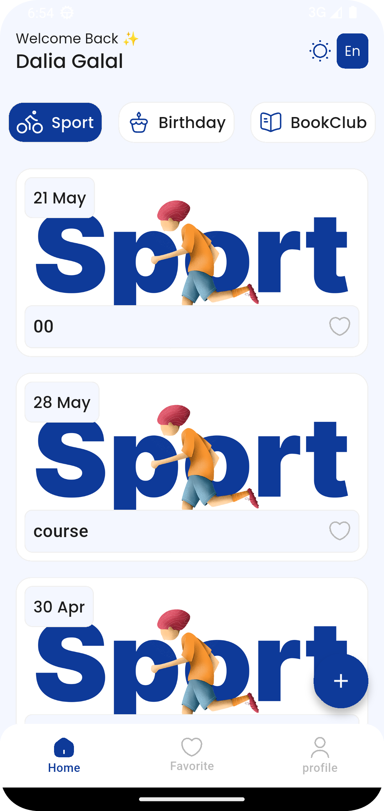
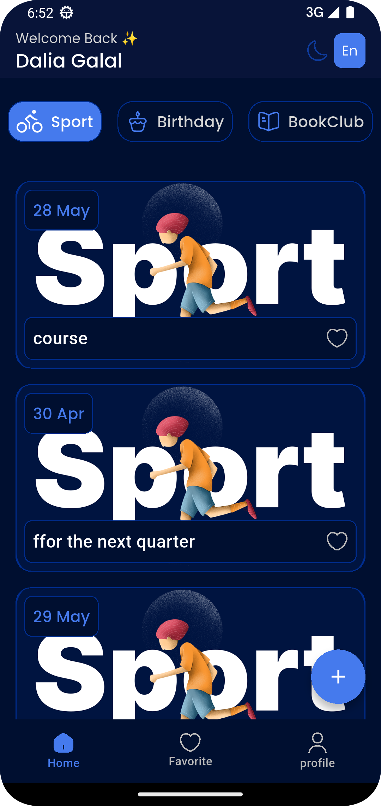
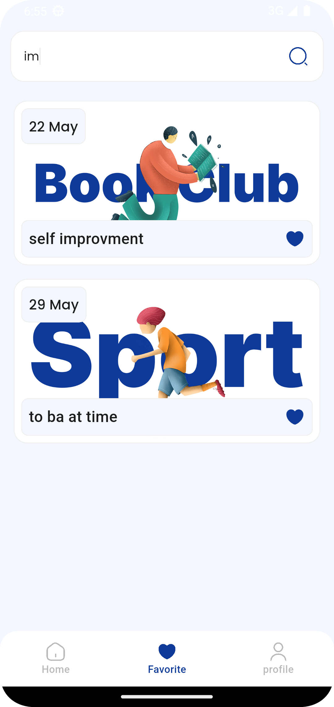
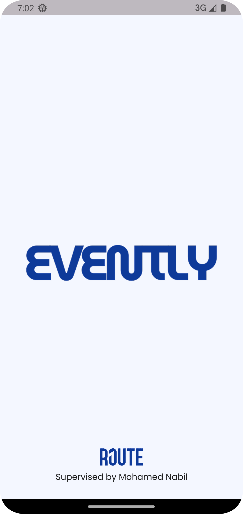
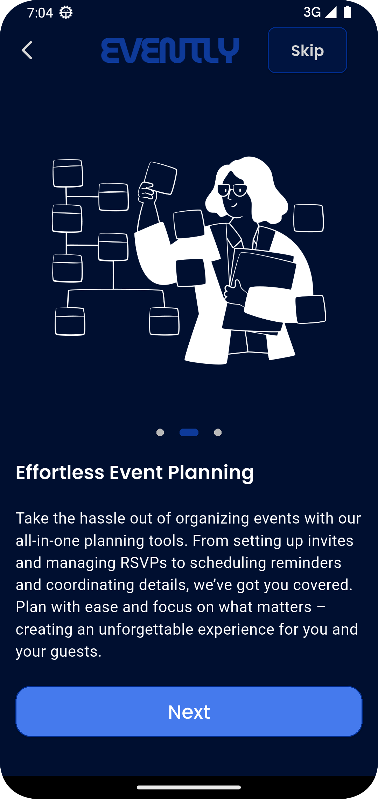
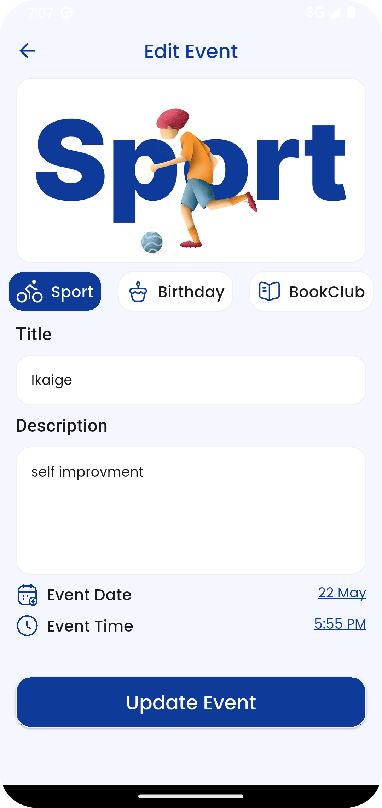
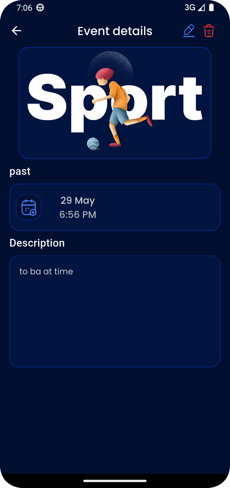
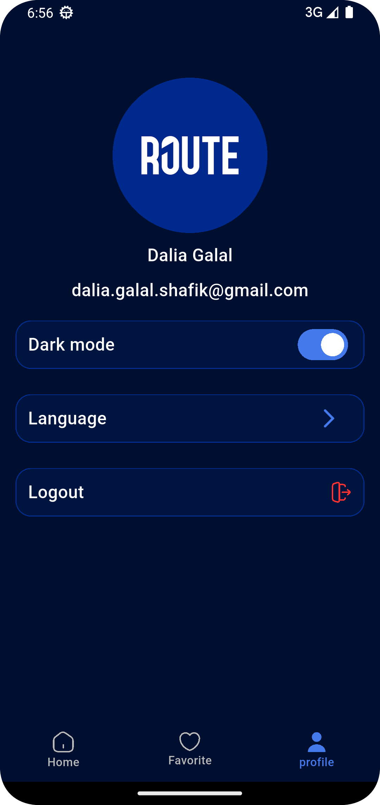
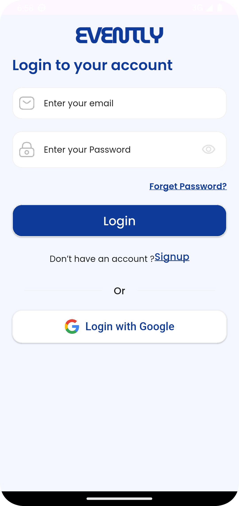
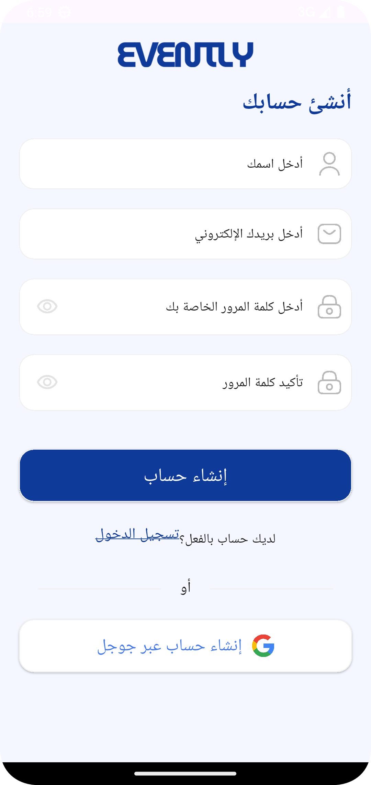

# EventlyApp 🗓️

A full-featured, multi-platform event management app built with Flutter and Firebase. EventlyApp lets users create, manage, and favorite personal events across categories — with full Arabic/English localization and dark/light theme support.

---

## Features

- **Authentication** — Email/password sign-up & sign-in, Google Sign-In, password reset
- **Event management** — Create, edit, delete, and view events with title, description, date, time, and category
- **Favorites** — Mark events as favorites with instant optimistic UI update
- **Search** — Real-time search across favorite events
- **Categories** — Sport, Birthday, Book Club (with light/dark category images)
- **Onboarding** — Multi-page onboarding flow shown once on first launch
- **Localization** — Full Arabic and English support with RTL layout
- **Theming** — Light and dark mode, persisted across sessions
- **Multi-platform** — Android, iOS, Web, Windows, macOS, Linux

---

## Tech Stack

| Layer | Technology |
|---|---|
| Framework | Flutter (Dart) |
| Backend | Firebase (Firestore + Auth) |
| State management | Provider (`ChangeNotifier`) |
| Local storage | SharedPreferences |
| Localization | Flutter l10n (ARB files) |
| Auth | Firebase Auth + Google Sign-In |
| Loading & toasts | EasyLoading + BotToast |
| Asset generation | FlutterGen |

---

## Project Structure

```
lib/
├── core/
│   ├── app_theme/        # ThemeManager, ColorPalette
│   ├── l10n/             # Localization ARB files
│   ├── providers/        # AuthenticationProvider, AppProvider
│   ├── routes/           # AppRouter, PagesRouteName
│   └── widgets/          # Shared reusable widgets
├── models/               # EventDataModel, UserDataModel, EventCategoryModel
├── modules/              # Feature screens (login, sign_up, home, add_event, etc.)
├── services/             # SnackBarServices, EasyLoadingService
├── utils/                # FirestoreUtils, FirebaseAuthenticationUtils
└── main.dart
```

---

## Architecture

The app follows a clean 3-layer architecture:

```
Utils     →  Pure Firebase calls only — no error handling, no UI
Provider  →  Catches errors, stores state, calls notifyListeners()
Screen    →  Reads state from provider, never calls Firebase directly
```

Firestore uses `withConverter<T>` for full type safety at the database layer.

---
## Screenshots
| Home Light Mode                                                       | Home Dark Mode                                                       | Search Favorite Screen                                      |
|-----------------------------------------------------------------------|----------------------------------------------------------------------|-------------------------------------------------------------|
|  |  |  |

| Splash Screen                                                 | OnBoarding Screen Dark                                                      | First OnBoarding Screen                                                      |
|---------------------------------------------------------------|-----------------------------------------------------------------------------------|------------------------------------------------------------------------------|
|  |  |  

| Edit Event                                                            | Event Details                                                         | Profile Dark Mode                                                             |
|-----------------------------------------------------------------------|-----------------------------------------------------------------------|-------------------------------------------------------------------------------|
|  |  |  |

| Login Screen English                                                       | Register Screen Arabic                                                        | 
|----------------------------------------------------------------------------|-------------------------------------------------------------------------------|
|  |  |
## Getting Started

### Prerequisites

- Flutter SDK `^3.10.1`
- A Firebase project with Firestore and Authentication enabled
- Google Sign-In configured in your Firebase project

### Setup

1. **Clone the repository**
   ```bash
   git clone https://github.com/Dalia-Galal/EventlyApp.git
   cd EventlyApp
   ```

2. **Install dependencies and generate localization files**
   ```bash
   flutter pub get
   ```
   > Localization files are auto-generated from `l10n.yaml` — no extra command needed.

3. **Configure Firebase**

   Add your `google-services.json` (Android) and `GoogleService-Info.plist` (iOS) from your Firebase console.

4. **Set up environment variables**

   Create a `.env` file in the project root:
   ```
   ServerClientId=YOUR_GOOGLE_SERVER_CLIENT_ID
   ```

5. **Run the app**
   ```bash
   flutter run
   ```

---

## Dependencies

```yaml
firebase_core, cloud_firestore, firebase_auth
provider
google_sign_in
shared_preferences
flutter_easyloading
bot_toast
flutter_dotenv
flutter_svg
flutter_localizations
intl
```

---

## Localization

The app supports **English** and **Arabic** (with RTL layout). Localization strings live in:

```
lib/core/l10n/app_en.arb   ← English strings
lib/core/l10n/app_ar.arb   ← Arabic strings
```

To add a new string, update both ARB files and run `flutter pub get` — the generated files update automatically.

---

## Contributing

1. Fork the repository
2. Create a feature branch: `git checkout -b feat/your-feature`
3. Commit with conventional commits: `feat:`, `fix:`, `refactor:`
4. Push and open a Pull Request

---

## Author

**Dalia Galal** — [github.com/Dalia-Galal](https://github.com/Dalia-Galal)

**Linkedin** — [linkedin.com/Dalia-Galal](https://linkedin.com/in/dalia-galal)

